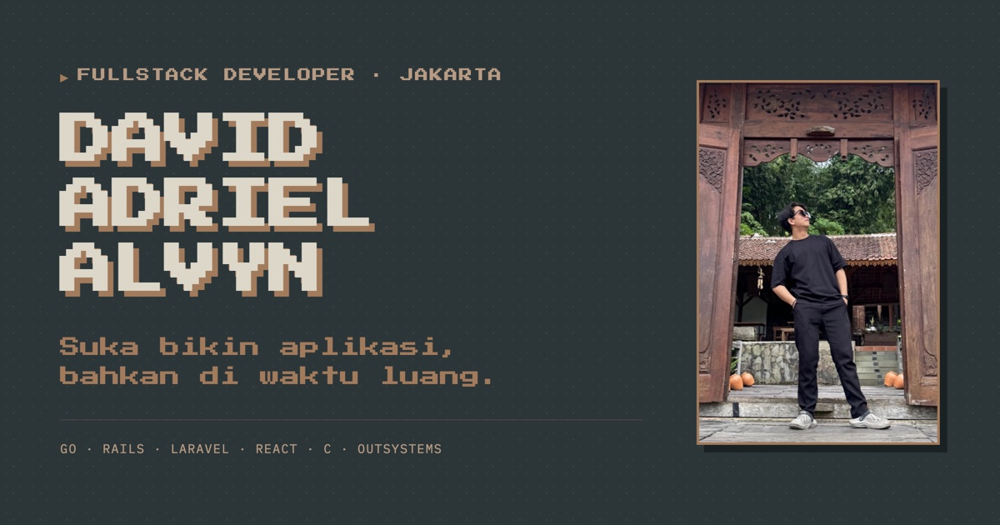

# Portfolio — David Adriel Alvyn

Portfolio satu halaman bertema 8-bit. React + Vite + Tailwind v4, dua bahasa (ID/EN),
enam section dengan scroll snap penuh layar.



---

## Menjalankan

Butuh Node 18+.

```bash
npm install
npm run dev        # http://localhost:5173
npm run build      # keluar ke dist/
npm run preview    # cek hasil build sebelum deploy
```

Tidak ada test runner dan tidak ada linter di project ini.

---

## Struktur

```
index.html               # meta, OG tags, favicon, fallback <noscript>
src/
  main.jsx               # entry
  App.jsx                # URUTAN SECTION + IntersectionObserver untuk nav aktif
  index.css              # design token, aturan tipografi, scanline, keyframes
  context/
    LanguageContext.jsx  # state ID/EN, disimpan di localStorage
  data/
    profile.js           # nama, email, sosial, pendidikan
    work.js              # pengalaman kerja + 9 situs brand
    projects.js          # data project NON-teks: repo, docs, shot, live
    translations.js      # SELURUH teks, ID dan EN
  sections/
    Hero.jsx             # title card: nama besar, tesis, portrait hover
    About.jsx
    ProfessionalWork.jsx
    Projects.jsx         # tab 4 project
    TechStack.jsx
    Contact.jsx
  components/
    Navbar.jsx           # nav + pemilih bahasa
    PixelCharacter.jsx   # sprite GIF (waving/coding/dancing/walking)
    PixelIcons.jsx       # ikon SVG piksel 16x16
    ShuffleText.jsx      # animasi teks scramble
    SectionDownArrow.jsx # indikator lanjut ke section berikutnya
  lib/
    motion.js            # gsap + onMotionOK()
public/
  favicon.svg            # diamond copper, sama dengan logo navbar
  og-image.jpg           # 1200x630, kartu preview sosial
  portrait-david.jpg     # foto hero, muncul saat hover
  sprites/*.gif          # 4 sprite karakter
  shots/                 # tangkapan layar project
```

---

## Design system

Token didefinisikan di `src/index.css` dalam blok `@theme`. Rasio kontrasnya sudah
**diukur**, bukan diperkirakan — memakai warna di luar perannya akan merusak
keterbacaan.

| Token | Nilai | Peran |
|---|---|---|
| `--color-ink` | `#2C3639` | latar |
| `--color-surface` | `#3F4E4F` | kartu. **Jangan jadi border** — kontrasnya 1,43:1 |
| `--color-copper` | `#A27B5C` | border 2px, heading besar, blok isian |
| `--color-sand` | `#B89B83` | label kecil, angka, tautan |
| `--color-cream` | `#DCD7C9` | teks utama |
| `--color-shadow` | `#1A2123` | hard offset shadow |

### Aturan ukuran font-pixel — jangan dilanggar

Press Start 2P digambar pada grid 8×8 piksel. Ia hanya render **tajam pada kelipatan
8**: 16, 24, 32, 40, 56, 64. Pada 9px/10px/11px pikselnya jatuh di antara piksel
layar, tebalnya tidak rata, dan hasilnya buram — merusak justru efek yang dicari.

**Batas bawah 16px**, bukan 14px. Untuk teks kecil pakai `--font-body` (IBM Plex
Mono), bukan font pixel yang diperkecil.

### Shadow

Selalu **hard offset**, tanpa blur: `box-shadow: 6px 6px 0 var(--color-shadow)`.
Ini tanda tangan visual halaman. Kalau perlu efek hover, tumbuhkan offsetnya
(6px → 10px) — jangan tukar dengan shadow blur, karena satu elemen dengan shadow
lembut akan terlihat asing di antara semua kartu lain.

### Latar jangan dicat ulang

Grid titik dua lapis dipegang `<html>` di `index.css`. **Jangan menaruh `bg-ink`
pada pembungkus atau `<main>`** — itu mengecat di atasnya dan coraknya hilang
sepenuhnya, sementara browser tetap menghitungnya. Kalau sebuah kartu butuh latar,
pakai `bg-surface` pada kartunya.

---

## Mengedit konten

| Yang mau diubah | File |
|---|---|
| Semua teks, ID dan EN | `src/data/translations.js` |
| URL project (repo, docs, live) | `src/data/projects.js` |
| Situs brand tempat kerja | `src/data/work.js` |
| Email, sosial, pendidikan | `src/data/profile.js` |

**URL disimpan di `projects.js`, bukan `translations.js`.** URL bukan konten
terjemahan; menaruhnya per bahasa berarti dua salinan yang bisa berbeda diam-diam.

### Menampilkan tombol aplikasi live

Isi field `live` di `src/data/projects.js`:

```js
live: 'https://idx.domain-anda.com',   // null = tombol tidak dirender
```

Selama `null`, tombolnya tidak muncul — tautan menuju domain mati lebih buruk
daripada tidak ada tautan.

### Mengubah urutan section

Urutan hidup di **empat** tempat dan semuanya harus sinkron:

1. `src/App.jsx` — urutan render
2. `src/components/Navbar.jsx` — array `NAV_ITEMS` beserta `num`
3. `SectionDownArrow targetId` di tiap section — rantai panah bawah
4. `sectionNum` di `translations.js` — nomor yang tampil di heading, dua bahasa

Lupa salah satu tidak akan memunculkan error, hanya navigasi yang salah arah.

---

## Gerak dan aksesibilitas

**Setiap animasi wajib lewat `onMotionOK()`** dari `src/lib/motion.js`. Ini bukan
sopan santun: gerak yang tidak diminta bisa memicu mual bagi sebagian orang.

```js
import { useGSAP } from '@gsap/react'
import { gsap, onMotionOK } from '../lib/motion.js'

useGSAP(() => onMotionOK(() => {
  gsap.from('[data-boot]', { opacity: 0, x: -14, duration: 0.4, stagger: 0.11, ease: 'steps(4)' })
}), { scope: ref })
```

Yang sudah menghormati `prefers-reduced-motion`: scroll snap, scanline overlay,
`.nudge-down`, dan semua tween GSAP.

Kosakata gerak di sini **bertangga**, bukan halus — `ease: 'steps(4)'`, bukan
`power2.out`. Fade dan bounce cubic-bezier terbaca sebagai animasi web biasa dan
merusak nuansa 8-bit.

### Jebakan: `transition-all` bertabrakan dengan GSAP

Jangan pakai `transition-all` pada elemen yang opacity atau transform-nya ditulis
GSAP. CSS akan ikut mengklaim properti yang sama dan tweennya tersangkut —
elemennya bisa hilang total. Daftar properti yang memang milik CSS secara eksplisit:

```jsx
className="transition-[transform,border-color,box-shadow] duration-300 ease-out"
```

### Jebakan: inline style mengalahkan variant

`style={{ boxShadow: ... }}` menang atas `hover:[box-shadow:...]` apa pun. Kalau
sebuah shadow perlu berubah saat hover, pindahkan shadow dasarnya ke class.

---

## Deploy

Static site, tanpa backend. `npm run build` → sajikan `dist/`.

### Wajib sebelum deploy: isi domain di OG tags

`index.html` masih memakai `https://example.com`. Ganti di tiga baris:

```
og:url          → https://domain-anda.com/
og:image        → https://domain-anda.com/og-image.jpg
twitter:image   → https://domain-anda.com/og-image.jpg
```

URL absolut itu syarat, bukan gaya. Crawler Facebook, LinkedIn, dan WhatsApp tidak
reliabel menyelesaikan path relatif untuk `og:image` — dibiarkan relatif, preview-nya
muncul tanpa gambar.

Setelah live, scrape ulang manual di
[Facebook Sharing Debugger](https://developers.facebook.com/tools/debug/) dan
[LinkedIn Post Inspector](https://www.linkedin.com/post-inspector/); keduanya cache
agresif.

### Memperbarui OG image

`public/og-image.jpg` dibuat dengan merender kartu HTML di browser pada 1200×630,
bukan dengan memotong foto — foto aslinya 9:16 dan memaksakannya ke 1200×630 hanya
menyisakan pita sempit badan. Kalau perlu dibuat ulang: susun HTML 1200×630 dengan
token di atas, screenshot pada DPR 2, lalu turunkan ke 1200 lebar sebagai JPEG.

---

## Catatan jujur

**Kode mati.** Enam file komponen tidak dipakai siapa pun:

```
MarioAvatarBox.jsx   SkillLogos.jsx   (SkillLogos hanya dipakai MarioAvatarBox,
Pill.jsx             WalkingBuddy.jsx  dan MarioAvatarBox tidak dipakai sama sekali)
Reveal.jsx           SectionHeading.jsx
```

Semuanya sisa dari versi hero sebelumnya yang berisi terrain dan karakter berjalan.
Aman dihapus; masih ada karena belum ada yang membereskannya.

**Scroll bersarang.** Kartu project aktif di `Projects.jsx` punya
`max-h-[62vh] overflow-y-auto` di dalam section yang scroll-snap. Di viewport pendek
bagian caveat berada di bawah lipatan dan mudah terlewat.

**Navbar melanggar aturan font-pixel** yang didokumentasikan di atas — ia memakai
10–11px. Memperbaikinya berarti mengubah tinggi navbar, jadi dibiarkan sengaja.
