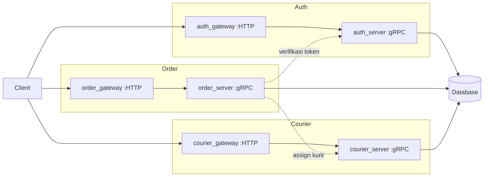

# Repo Remediation Implementation Plan (Workstream A)

> **For agentic workers:** REQUIRED SUB-SKILL: Use superpowers:subagent-driven-development (recommended) or superpowers:executing-plans to implement this plan task-by-task. Steps use checkbox (`- [ ]`) syntax for tracking.

**Goal:** Membenahi 4 repo publik `dvdadriel` (MarketScreener, News-Update, Go-Courier, Go-FoodStore) sehingga layak dipajang sebagai portofolio Backend/Fullstack Engineer, dimulai dari menutup kebocoran secret.

**Architecture:** Tiga fase berurutan. **Fase 1 (Task 1–4)** menutup kebocoran secret — didahulukan karena satu-satunya risiko yang bertambah seiring waktu. **Fase 2 (Task 5–16)** membenahi tiap repo, satu repo per blok task. **Fase 3 (Task 17)** merapikan profil GitHub. Setiap task berdiri sendiri dan bisa diverifikasi tanpa menunggu task berikutnya.

**Tech Stack:** Go 1.24 + gorm + gorilla/mux + MySQL (Go-FoodStore) · Ruby 3.3.8 + Rails 8.1 + PostgreSQL (MarketScreener) · Cloudflare Workers + wrangler (News-Update) · Go + gRPC + Docker Compose (Go-Courier) · git-filter-repo, GitHub Actions

**Spec:** `docs/superpowers/specs/2026-08-26-porto-design.md`

---

## Kondisi awal yang sudah terverifikasi

Diperiksa pada 2026-08-26, jangan diasumsikan ulang:

| Fakta | Nilai |
|---|---|
| `ruby` | 3.3.8 ✓ (cocok dengan `.ruby-version` CryptoScreener) |
| `bundle check` di CryptoScreener | "dependencies are satisfied" ✓ |
| PostgreSQL | `pg_isready` → accepting connections di `:5432` ✓ |
| `docker` | 29.5.3 ✓ |
| `node` / `npm` | 26.6.0 / 11.18.0 ✓ |
| `go` | **MISSING** — Task 0 |
| `git-filter-repo` | **MISSING** — Task 0 |
| `gh` | **MISSING** — Task 0 |
| Push ke GitHub | `git ls-remote` berhasil; SSH key `~/.ssh/id_ed25519.pub` ada. Push belum diverifikasi — Task 0 |
| Clone lokal MarketScreener | `~/Projects/CryptoScreener` (2 commit, banyak kerja belum ke-commit) |
| Clone lokal News-Update | `~/Documents/News-Update` (versi Cloudflare, 5 commit belum di-push) |
| Clone lokal Go-Courier, Go-FoodStore, TernaKu | **tidak ada** — perlu clone |

Go-FoodStore memakai **MySQL** (bukan PostgreSQL), lewat `gorm.io/driver/mysql`.

---

## File Structure

Repo yang disentuh dan tanggung jawab tiap file baru:

**Go-FoodStore** (`~/Projects/porto-work/Go-FoodStore`)
- `config/database.go` — *modifikasi:* DSN dibaca dari env, bukan hardcoded
- `config/database_test.go` — *baru:* test pembentukan DSN dari env
- `services/food_service/food_service_impl_test.go` — *baru:* unit test service + stub repo
- `services/food_service/stub_repo_test.go` — *baru:* stub `FoodRepo` (stdlib saja, tanpa library mock)
- `main.go` — *modifikasi:* bind address dari env, default `:8080`
- `.gitignore`, `.env.example`, `Dockerfile`, `docker-compose.yml`, `.github/workflows/ci.yml`, `README.md`, `LICENSE`, `docs/Go-FoodStore.postman_collection.json` — *baru*

**MarketScreener** (`~/Projects/CryptoScreener`)
- `README.md` — *tulis ulang*
- `docs/backtest-results.md`, `docs/images/*.png`, `LICENSE` — *baru*

**News-Update** (`~/Documents/News-Update`)
- `.gitignore`, `LICENSE`, `.github/workflows/ci.yml` — *baru*; `README.md` — *tambah screenshot*

**Go-Courier** (`~/Projects/porto-work/Go-Courier`)
- `*/Dockerfile` — *rename dari `DockerFile`*
- `README.md` — *tambah diagram Mermaid, contoh request*
- `.mailmap` — *baru:* satukan identitas author lama `KecoaxBunting` tanpa rewrite history
- `.github/workflows/ci.yml`, `LICENSE` — *baru*

Stub repo dipisah ke file sendiri (`stub_repo_test.go`) supaya test service tetap fokus ke perilaku, dan stub-nya bisa dipakai ulang saat menambah test service lain.

---

# FASE 1 — Tutup kebocoran secret

## Task 0: Prasyarat tooling

**Files:** tidak ada perubahan file.

- [ ] **Step 1: Install tooling yang hilang**

```bash
brew install go git-filter-repo gh
```

- [ ] **Step 2: Verifikasi semuanya terpasang**

```bash
go version && git filter-repo --version && gh --version
```

Expected: tiga baris versi, tanpa "command not found". `go version` minimal `go1.24` (Go-FoodStore butuh `go 1.24.0`).

- [ ] **Step 3: Login gh dan verifikasi identitas**

```bash
gh auth login    # pilih GitHub.com → SSH → gunakan ~/.ssh/id_ed25519
gh api user --jq .login
```

Expected: `dvdadriel`. Kalau bukan, **STOP** — akun yang aktif salah, dan force push di Task 2/3 bisa mengenai repo orang lain.

- [ ] **Step 4: Buat direktori kerja untuk repo yang belum ada lokal**

```bash
mkdir -p ~/Projects/porto-work
```

---

## Task 1: 🔴 Revoke Telegram bot token — DIKERJAKAN MANUAL OLEH DAVID

**Files:** tidak ada.

Ini **gerbang pemblokir**. Task 2 tidak boleh dimulai sebelum ini selesai. Purge history tidak menarik balik salinan yang sudah ter-clone, ter-fork, atau ter-index mesin pencari — revoke adalah satu-satunya mitigasi nyata. Token `TELEGRAM_TOKEN` (48 karakter) ada di `News-Update/.env` di repo publik.

- [ ] **Step 1: Revoke token lama**

Buka Telegram → chat **@BotFather** → `/mybots` → pilih bot news → **API Token** → **Revoke current token**.

- [ ] **Step 2: Simpan token baru sebagai Cloudflare secret, bukan ke file**

```bash
cd ~/Documents/News-Update
npx wrangler secret put BOT_TOKEN     # tempel token baru saat diminta
```

- [ ] **Step 3: Verifikasi token lama sudah mati**

Ganti `<TOKEN_LAMA>` dengan token dari `.env` yang bocor:

```bash
curl -s "https://api.telegram.org/bot<TOKEN_LAMA>/getMe"
```

Expected: `{"ok":false,"error_code":401,"description":"Unauthorized"}`

Kalau masih `"ok":true`, token **belum** ter-revoke — ulangi Step 1.

- [ ] **Step 4: Konfirmasi ke agen bahwa Step 3 sudah menghasilkan 401**

Tanpa konfirmasi ini, jangan lanjut ke Task 2.

---

## Task 2: Purge `.env` dan `.venv/` dari history News-Update

**Files:**
- Create: `~/Projects/porto-work/News-Update-purge/.gitignore`
- Rewrite history: seluruh commit di repo `dvdadriel/News-Update`

Repo publik saat ini berisi `.env` (dengan token yang sudah di-revoke di Task 1) dan `.venv/` — 1.656 file dependensi Python yang seharusnya tidak pernah masuk.

- [ ] **Step 1: Clone bare mirror sebagai bahan filter**

`git filter-repo` menolak bekerja di clone yang tidak segar, jadi pakai clone terpisah — bukan `~/Documents/News-Update` yang sedang dipakai.

```bash
cd ~/Projects/porto-work
git clone https://github.com/dvdadriel/News-Update.git News-Update-purge
cd News-Update-purge
```

- [ ] **Step 2: Buat cadangan sebelum menulis ulang history**

Rewrite history tidak bisa dibatalkan setelah force push. Cadangan ini jaring pengamannya.

```bash
cd ~/Projects/porto-work
git clone --mirror https://github.com/dvdadriel/News-Update.git News-Update-backup.git
du -sh News-Update-backup.git
```

Expected: direktori terbuat, ukurannya beberapa MB (repo ini 6,8 MB karena `.venv/`).

- [ ] **Step 3: Konfirmasi apa yang akan dihapus**

```bash
cd ~/Projects/porto-work/News-Update-purge
git log --all --full-history --oneline -- .env
```

Expected: minimal satu commit tampil. Kalau kosong, path-nya salah — periksa dengan `git log --all --name-only | grep -i env`.

- [ ] **Step 4: Purge**

```bash
cd ~/Projects/porto-work/News-Update-purge
git filter-repo --invert-paths --path .env --path .venv --force
```

Expected: output diakhiri `Completely finished after ...`.

- [ ] **Step 5: Verifikasi keduanya hilang dari seluruh history**

```bash
git log --all --full-history --oneline -- .env
git log --all --full-history --oneline -- .venv
```

Expected: **kedua perintah tidak mengeluarkan apa pun.** Kalau masih ada output, jangan lanjut — ulangi Step 4.

- [ ] **Step 6: Tambahkan `.gitignore` supaya tidak terulang**

Repo ini sebelumnya tidak punya `.gitignore` sama sekali — itu akar masalahnya.

Create `.gitignore`:

```gitignore
# secrets
.env
.dev.vars
.env.local

# python (versi lama repo ini)
.venv/
__pycache__/
*.pyc

# node
node_modules/

# tooling
.wrangler/
logs/
.DS_Store
```

- [ ] **Step 7: Commit `.gitignore`**

```bash
git add .gitignore
git commit -m "chore: add gitignore to prevent committing secrets and dependencies"
```

- [ ] **Step 8: Force push history yang sudah bersih**

`filter-repo` menghapus remote `origin` secara sengaja, jadi tambahkan kembali.

```bash
git remote add origin git@github.com:dvdadriel/News-Update.git
git push origin --force --all
git push origin --force --tags
```

- [ ] **Step 9: Verifikasi dari sisi GitHub, bukan dari lokal**

```bash
curl -s -o /dev/null -w "%{http_code}\n" https://raw.githubusercontent.com/dvdadriel/News-Update/HEAD/.env
```

Expected: `404`

---

## Task 3: Purge `.env` dari history TernaKu dan rotate `APP_KEY`

**Files:** Rewrite history repo `dvdadriel/TernaKu`.

TernaKu tidak akan dipajang di portofolio (lihat spec, "Yang sengaja tidak dikerjakan"), tapi `.env`-nya memuat `APP_KEY` Laravel asli (51 karakter) — itu isu keamanan yang tetap harus ditutup. Kredensial DB-nya `localhost`/`root` sehingga risikonya rendah.

- [ ] **Step 1: Clone dan cadangkan**

```bash
cd ~/Projects/porto-work
git clone https://github.com/dvdadriel/TernaKu.git TernaKu-purge
git clone --mirror https://github.com/dvdadriel/TernaKu.git TernaKu-backup.git
```

- [ ] **Step 2: Purge `.env`**

```bash
cd ~/Projects/porto-work/TernaKu-purge
git filter-repo --invert-paths --path .env --force
```

- [ ] **Step 3: Verifikasi bersih**

```bash
git log --all --full-history --oneline -- .env
```

Expected: tidak ada output.

- [ ] **Step 4: Pastikan `.env` sudah ter-ignore**

```bash
grep -n '^\.env' .gitignore
```

Expected: minimal satu baris cocok. Repo ini sudah punya `.gitignore` dengan `.env` — kebocorannya terjadi karena file itu ter-commit sebelum aturan ignore berlaku. Kalau tidak cocok, tambahkan `.env` ke `.gitignore` dan commit.

- [ ] **Step 5: Force push**

```bash
git remote add origin git@github.com:dvdadriel/TernaKu.git
git push origin --force --all
git push origin --force --tags
```

- [ ] **Step 6: Verifikasi dari GitHub**

```bash
curl -s -o /dev/null -w "%{http_code}\n" https://raw.githubusercontent.com/dvdadriel/TernaKu/HEAD/.env
```

Expected: `404`

- [ ] **Step 7: Catat bahwa `APP_KEY` sudah tidak boleh dipakai lagi**

`APP_KEY` yang bocor tidak perlu di-rotate di server mana pun (TernaKu tidak ter-deploy), tapi **jangan** dipakai ulang di project lain. Kalau suatu saat TernaKu di-deploy, jalankan `php artisan key:generate` lebih dulu.

---

## Task 4: Push News-Update versi Cloudflare Workers

**Files:**
- Modify: `~/Documents/News-Update/README.md`
- Create: `~/Documents/News-Update/LICENSE`, `~/Documents/News-Update/.github/workflows/ci.yml`, `~/Documents/News-Update/docs/images/dashboard.png`

Versi lokal (Cloudflare Workers, cron 3×/hari, ringkasan NVIDIA NIM, dedup Workers KV, dashboard Basic Auth) belum pernah di-push. Versi publik masih script Python. Sinkronkan.

- [ ] **Step 1: Selaraskan clone lokal dengan history yang sudah dipurge**

History remote sudah ditulis ulang di Task 2, jadi `~/Documents/News-Update` sekarang punya history yang tidak lagi cocok.

```bash
cd ~/Documents/News-Update
git status --short          # pastikan tidak ada kerja yang belum ke-commit
git log --oneline -5        # catat 5 commit lokal yang mau dipertahankan
```

Expected: working tree bersih; terlihat `832628e feat: web dashboard ...` di paling atas.

Kalau ada file yang belum ke-commit, commit dulu sebelum lanjut.

- [ ] **Step 2: Rebase kerja lokal ke atas history yang sudah bersih**

```bash
cd ~/Documents/News-Update
git fetch origin
git rebase --onto origin/main $(git merge-base HEAD origin/main) HEAD
```

Kalau rebase konflik atau history-nya sudah tidak berkerabat, pakai jalan yang lebih sederhana: salin isi `src/`, `wrangler.toml`, `package.json`, `README.md`, dan `test/` ke `~/Projects/porto-work/News-Update-purge`, lalu commit di sana sebagai satu commit `feat: rewrite as Cloudflare Worker with AI summarization`. Hasil akhirnya sama; jangan habiskan waktu untuk memaksa rebase.

- [ ] **Step 3: Ambil screenshot dashboard**

```bash
cd ~/Documents/News-Update
npx wrangler dev
```

Buka `http://localhost:8787/` di browser, login Basic Auth, screenshot, simpan sebagai `docs/images/dashboard.png`. Hentikan `wrangler dev` setelahnya.

**Sensor sebelum menyimpan:** buram/hitamkan nama bot dan chat ID kalau tampil.

- [ ] **Step 4: Tambahkan LICENSE**

Create `LICENSE` — MIT, `Copyright (c) 2026 David Adriel Alvyn`. Ambil teks lengkapnya dari https://opensource.org/license/mit (jangan tulis dari ingatan; teks lisensi harus persis).

- [ ] **Step 5: Tambahkan screenshot ke README**

Sisipkan setelah paragraf pembuka `README.md`:

```markdown

```

- [ ] **Step 6: Tambahkan CI**

Create `.github/workflows/ci.yml`:

```yaml
name: CI

on:
  push:
    branches: [main]
  pull_request:

jobs:
  check:
    runs-on: ubuntu-latest
    steps:
      - uses: actions/checkout@v4
      - uses: actions/setup-node@v4
        with:
          node-version: '22'
      - run: npm ci
      - name: Verify worker builds
        run: npx wrangler deploy --dry-run --outdir=/tmp/worker-build
```

`--dry-run` membundel worker tanpa deploy dan tanpa butuh kredensial Cloudflare — jadi CI ini tetap jalan di fork dan pull request.

- [ ] **Step 7: Commit dan push**

```bash
cd ~/Documents/News-Update
git add LICENSE README.md docs/images/dashboard.png .github/workflows/ci.yml
git commit -m "docs: add dashboard screenshot, license, and CI"
git push origin main
```

- [ ] **Step 8: Verifikasi**

```bash
gh run list --repo dvdadriel/News-Update --limit 1
curl -s https://api.github.com/repos/dvdadriel/News-Update | python3 -c "import sys,json; d=json.load(sys.stdin); print(d['language'], d['size'], 'KB')"
```

Expected: CI run muncul dan akhirnya `success`. `language` menjadi `JavaScript` dan `size` turun drastis dari 6.850 KB (bukti `.venv/` sudah hilang).

---

# FASE 2 — Pembenahan per repo

## Task 5: Pecah kerja MarketScreener yang belum ke-commit

**Files:**
- Modify: `~/Projects/CryptoScreener` — commit file yang sudah ada di working tree

Masalah kredibilitas terbesar: aplikasi Rails 207 file dengan **2 commit** (`initial`, `update readme`). History lama tidak dipalsukan mundur. Tapi ada tumpukan kerja belum ke-commit yang cukup untuk membangun history yang terbaca ke depan.

File yang tersedia (terverifikasi dari `git status`): `app/services/evidence_backup_service.rb`, `app/services/momentum_gate_evaluator.rb`, `app/services/momentum_snapshot_backfill_service.rb`, `app/jobs/evidence_backup_job.rb`, `lib/tasks/backup.rake`, plus perubahan di `idx_market_state.rb`, `momentum_backtest_service.rb`, `momentum_ranking_service.rb`, `signal_confluence_service.rb`, `telegram_command_service.rb`, `telegram_notifier.rb`, `health_check.rb`, `config/recurring.yml`, `test/jobs/momentum_snapshot_job_test.rb`, dan `.gitignore`.

> ## ⚠️ SUDAH DIKERJAKAN — pengelompokan di bawah TERBUKTI SALAH, jangan dipakai lagi
>
> Task ini selesai pada 2026-08-26 dan menghasilkan 9 commit (11 total). **Pengelompokan Step 4–11 di bawah ini disusun dari nama file tanpa membaca diff-nya, dan tiga pesan commit-nya faktual salah:**
>
> - Step 4 `chore: ignore local env and credential files` — satu-satunya perubahan `.gitignore` adalah `+/storage/db_backups/`. `.env` dan `master.key` sudah ter-ignore sejak commit `initial`. Pesan ini akan jadi pernyataan palsu.
> - Step 5 `extract promotion gate evaluation into MomentumGateEvaluator ... sebelumnya menyebar di IdxMarketState` — tidak ada yang dipindahkan keluar dari `IdxMarketState`. Diff-nya sebenarnya state machine histeresis regime (`CONFIRM_DAYS = 5`), tidak berhubungan dengan evaluator.
> - Step 8 `feat(backtest): account for fees, slippage, and position sizing` — `cost_pct: 0.4` sudah ada sebelumnya. Diff `momentum_ranking_service.rb` sebenarnya momentum residual beta-adjusted (OLS satu faktor vs `^JKSE`).
> - Step 9 `feat(telegram): mute confluence alerts while strategy is under observation` — tidak cocok dengan diff mana pun. `signal_confluence_service.rb` justru **menambah** method `#detail` untuk tampilan.
>
> Daftar file di atas juga tidak lengkap: `app/jobs/rank_report_job.rb`, `test/jobs/rank_report_job_test.rb`, dan `test/services/momentum_backtest_service_test.rb` masih untracked saat plan ini ditulis sehingga terlewat.
>
> **Commit yang benar-benar dibuat**, berdasarkan pembacaan diff:
>
> | SHA | Pesan |
> |---|---|
> | `ff6c43d` | `feat(regime): require multi-day confirmation before flipping IDX regime` |
> | `e60b62a` | `feat(momentum): rank by beta-adjusted residual momentum` |
> | `efa9ed2` | `feat(backtest): add buffer-zone rebalancing and fail on incomplete universe` |
> | `1ceb973` | `feat(momentum): show risk-off ranking as an explicit watchlist` |
> | `340a009` | `feat(momentum): send daily rank report with confluence cards for new picks` |
> | `9e3d55f` | `feat(momentum): backfill missing snapshot days and skip stale data` |
> | `908e18b` | `feat(ops): watchdog for silently failing momentum snapshot job` |
> | `6408801` | `feat(momentum): evaluate strategy promotion criteria automatically` |
> | `014767a` | `feat(backup): persist forward-tracking evidence to disk` |
>
> **Pelajaran untuk task berikutnya di plan ini: jangan menulis pesan commit dari nama file. Baca diff-nya dulu.** Semua langkah di bawah tetap disimpan sebagai catatan sejarah, bukan instruksi.

- [ ] **Step 1: Reset staging area tanpa menghilangkan pekerjaan**

Sebagian file sudah ter-stage (`M `, `A `). Kosongkan staging supaya bisa dipilih per kelompok; perubahan di working tree tetap utuh.

```bash
cd ~/Projects/CryptoScreener
git reset
git status --short
```

Expected: semua baris kini berawalan spasi atau `??` — tidak ada lagi yang ter-stage.

- [ ] **Step 2: Pastikan `.gitignore` tidak membocorkan apa pun**

```bash
cd ~/Projects/CryptoScreener
git diff .gitignore
grep -nE '^\.env|master\.key|credentials' .gitignore
```

Expected: `.env` dan `config/master.key` ter-ignore. Rails menyimpan kredensial terenkripsi di `config/credentials.yml.enc` dan kuncinya di `config/master.key` — **`master.key` tidak boleh pernah ter-commit.** Kalau belum ada di `.gitignore`, tambahkan sekarang.

- [ ] **Step 3: Verifikasi `master.key` belum pernah ter-commit**

```bash
git log --all --full-history --oneline -- config/master.key
```

Expected: tidak ada output. Kalau ada output, **STOP** — ini kebocoran secret ketiga, tangani dengan prosedur yang sama seperti Task 2 sebelum melanjutkan.

- [ ] **Step 4: Commit 1 — gitignore**

```bash
git add .gitignore
git commit -m "chore: ignore local env and credential files"
```

- [ ] **Step 5: Commit 2 — regime gate evaluator**

```bash
git add app/services/momentum_gate_evaluator.rb app/services/idx_market_state.rb
git commit -m "feat(momentum): extract promotion gate evaluation into MomentumGateEvaluator

Aturan promosi strategi sebelumnya menyebar di IdxMarketState. Dipindahkan
ke evaluator terpisah supaya keputusan gate bisa diuji tanpa memanggil
market state secara utuh."
```

- [ ] **Step 6: Commit 3 — snapshot backfill**

```bash
git add app/services/momentum_snapshot_backfill_service.rb app/models/momentum_snapshot.rb app/jobs/momentum_snapshot_job.rb
git commit -m "feat(momentum): backfill historical snapshots for forward tracking

Forward tracking butuh riwayat snapshot yang berkesinambungan. Service ini
mengisi tanggal yang bolong tanpa menimpa snapshot yang sudah ada."
```

- [ ] **Step 7: Commit 4 — evidence backup**

```bash
git add app/services/evidence_backup_service.rb app/jobs/evidence_backup_job.rb lib/tasks/backup.rake
git commit -m "feat(backup): persist backtest and snapshot evidence to disk

Hasil backtest sebelumnya hanya hidup di database lokal. Backup ini yang
nantinya jadi bahan hasil yang dipublikasikan di README."
```

- [ ] **Step 8: Commit 5 — backtest**

```bash
git add app/services/momentum_backtest_service.rb app/services/momentum_ranking_service.rb lib/tasks/momentum.rake
git commit -m "feat(backtest): account for fees, slippage, and position sizing"
```

- [ ] **Step 9: Commit 6 — notifikasi Telegram**

```bash
git add app/services/telegram_notifier.rb app/services/telegram_command_service.rb app/services/signal_confluence_service.rb
git commit -m "feat(telegram): mute confluence alerts while strategy is under observation"
```

- [ ] **Step 10: Commit 7 — health & scheduling**

```bash
git add app/services/health_check.rb app/jobs/health_monitor_job.rb app/jobs/momentum_weekly_report_job.rb config/recurring.yml
git commit -m "feat(ops): add health monitoring and weekly momentum report job"
```

- [ ] **Step 11: Commit 8 — test**

```bash
git add test/
git commit -m "test(momentum): cover snapshot job scheduling and idempotency"
```

- [ ] **Step 12: Commit sisanya**

```bash
git status --short
```

Kalau masih ada file tersisa, kelompokkan per kepedulian dan commit dengan pesan conventional. **Jangan** membuat satu commit `misc` — itu justru mengulangi masalah yang sedang diperbaiki.

- [ ] **Step 13: Verifikasi test masih hijau**

```bash
cd ~/Projects/CryptoScreener
bin/rails test
```

Expected: semua test lulus. Kalau gagal, perbaiki di commit `fix:` terpisah — jangan amend commit di atas.

- [ ] **Step 14: Verifikasi history dan push**

```bash
git log --oneline
git rev-list --count HEAD
git push origin main
```

Expected: 10 commit atau lebih, tiap pesannya menjelaskan satu perubahan bermakna.

---

## Task 6: Jalankan backtest dan kumpulkan hasil

**Files:**
- Create: `~/Projects/CryptoScreener/docs/backtest-results.md`, `~/Projects/CryptoScreener/docs/images/equity-curve.png`

Ini pembeda terkuat portofolio ini. Menerbitkan hasil asli **beserta batasannya** jauh lebih meyakinkan daripada menambah fitur.

Rake task berikut sudah **diverifikasi ada** di `lib/tasks/` pada 2026-08-26. Pakai persis ini, jangan menebak dan jangan menambah rake task baru.

- [ ] **Step 1: Backtest portofolio momentum (angka utama untuk README)**

`momentum:backtest[days,universe,offset,buffer]` — rebalance bulanan, fee 0.4%, lewat `MomentumBacktestService`. Mengeluarkan `ret`, `maxDD`, `Sharpe`, `win`, `periods`, `cash`.

```bash
cd ~/Projects/CryptoScreener
bin/rails 'momentum:backtest[365,extended,0,15]' 2>&1 | tee /tmp/mom-backtest-365.txt
bin/rails 'momentum:backtest[730,extended,0,15]' 2>&1 | tee /tmp/mom-backtest-730.txt
bin/rails 'momentum:backtest[1095,extended,0,15]' 2>&1 | tee /tmp/mom-backtest-1095.txt
```

- [ ] **Step 2: Buffer sweep — ini yang mengisi tabel walk-forward**

`momentum:buffer_sweep[universe]` sudah menyapu jendela 365/730/1095 hari × buffer 0/12/15/20 dan mencetak `ret`, `alpha`, `maxDD`, `Sharpe` per kombinasi. Satu perintah ini menghasilkan seluruh tabel walk-forward — tidak perlu skrip sekali pakai.

```bash
bin/rails 'momentum:buffer_sweep[extended]' 2>&1 | tee /tmp/buffer-sweep.txt
```

Jalannya beberapa menit (12 backtest penuh). Biarkan selesai.

- [ ] **Step 3: Backtest per-trade lintas strategi**

`backtest:run[days,strategy,universe,cost,slippage,risk]` — lewat `BacktestService`, mengeluarkan tabel per strategi berisi `n`, `WR%`, `exp%`, `PF`, `Sharpe`, `ret%`, `maxDD%`. Inilah sumber angka untuk bagian "Strategi yang gagal", termasuk bukti `SqueezeBreakout` merugi.

```bash
bin/rails 'backtest:run[730,all,extended,0.4,0.1,1.0]' 2>&1 | tee /tmp/backtest-run.txt
```

Catatan dari output task ini: **gate regime di-bypass** saat backtest. Sebutkan itu di bagian asumsi.

- [ ] **Step 3b: Ambil status forward tracking**

```bash
bin/rails momentum:paper 2>&1 | tee /tmp/paper.txt
```

Mengeluarkan equity paper vs IHSG, alpha, maxDD, dan jumlah hari-snapshot sejak inception. **Jumlah hari-snapshot inilah angka konkret untuk klaim "sampel masih pendek"** di bagian batasan — pakai angka nyata, jangan kira-kira.

- [ ] **Step 4: Buat grafik equity curve**

Gunakan data hasil Step 2. Simpan sebagai `docs/images/equity-curve.png`. Sumbu-Y diberi label dan diberi keterangan bahwa sudah termasuk fee dan slippage.

- [ ] **Step 5: Tulis hasilnya**

Create `docs/backtest-results.md`:

```markdown
# Hasil Backtest

**Dijalankan:** <tanggal>
**Universe:** saham IDX (`.JK`), benchmark `^JKSE`
**Strategi:** cross-sectional momentum, rebalance bulanan


## Metrik

| Metrik | Strategi | Benchmark (IHSG) |
|---|---|---|
| Total return | <isi> | <isi> |
| CAGR | <isi> | <isi> |
| Max drawdown | <isi> | <isi> |
| Win rate | <isi> | — |
| Sharpe | <isi> | <isi> |
| Jumlah trade | <isi> | — |

## Asumsi

- Fee: <isi>
- Slippage: <isi>
- Position sizing: <isi>
- Periode: <isi> (<isi> bulan)

## Validasi walk-forward

| Jendela | Return | Max DD |
|---|---|---|
| <isi> | <isi> | <isi> |

## Batasan — baca bagian ini

- **Sampel masih pendek.** <isi jumlah bulan>. Terlalu singkat untuk
  menyimpulkan strategi ini bekerja; belum melewati satu siklus pasar penuh.
- **Survivorship bias.** Universe dibentuk dari saham yang masih listing hari
  ini, jadi emiten yang sudah delisting tidak ikut terhitung.
- **Belum ada uang sungguhan.** Semua angka di sini hasil paper trading dan
  backtest, bukan eksekusi nyata.
- **Fee dan slippage adalah estimasi**, bukan hasil fill sebenarnya.

## Strategi yang gagal

Dicantumkan karena hasil negatif tetap hasil, dan menyembunyikannya membuat
angka di atas tidak bisa dinilai secara jujur.

- **`SqueezeBreakoutService` untuk saham IDX** — terbukti rugi. Dipertahankan
  di kode tapi dibatasi hanya untuk crypto. <isi angkanya>
- **`SignalConfluenceService`** — masih paper baseline, alert di-mute karena
  belum melewati gate promosi.
```

Isi setiap `<isi>` dengan angka nyata dari output. **Placeholder yang dibiarkan kosong lebih buruk daripada tidak menerbitkan sama sekali** — itu terbaca sebagai dokumen yang ditinggalkan setengah jalan.

- [ ] **Step 6: Commit**

```bash
cd ~/Projects/CryptoScreener
git add docs/backtest-results.md docs/images/equity-curve.png
git commit -m "docs: publish backtest results with assumptions and limitations"
```

---

## Task 7: README MarketScreener dan screenshot

**Files:**
- Modify: `~/Projects/CryptoScreener/README.md`
- Create: `~/Projects/CryptoScreener/docs/images/dashboard.png`, `~/Projects/CryptoScreener/docs/images/telegram-alert.png`, `~/Projects/CryptoScreener/LICENSE`

README sekarang sudah bagus secara teknis tapi ditulis untuk diri sendiri — tidak menjelaskan *kenapa* project ini ada, dan tidak ada satu pun bukti visual.

- [ ] **Step 1: Jalankan aplikasi**

```bash
cd ~/Projects/CryptoScreener
bin/rails server
```

- [ ] **Step 2: Ambil screenshot**

Buka dashboard di browser, simpan `docs/images/dashboard.png`. Ambil juga screenshot satu alert Telegram, simpan `docs/images/telegram-alert.png`.

**Sensor:** hilangkan nama akun, chat ID, dan nominal portofolio pribadi kalau tampil.

- [ ] **Step 2b: Perbaiki link mati ke `guideline/`**

Terverifikasi 2026-08-26: `README.md` baris 9 menaut ke `` [`guideline/`](guideline/) ``, tapi `.gitignore` baris 48 meng-ignore `/guideline`. Direktori itu tidak pernah ter-commit, jadi **link itu 404 di repo publik.**

Isinya memang tidak untuk publik: `soul.md`, `logic.md`, `improvement_plan.md`, `list_improvement.md`, `feature.md`, plus `guideline/awesome-systematic-trading-main` — dump repo pihak ketiga yang tidak boleh ikut ter-commit (bloat dan persoalan lisensi).

Jadi jangan menerbitkan `guideline/`. **Hapus link itu** dan arahkan ke dokumen hasil yang memang publik:

```markdown
> **Status:** fokus saham IDX; crypto dinonaktifkan (`CRYPTO_ENABLED`, default off).
> Strategi aktif dalam observasi: **cross-sectional momentum** (forward tracking harian,
> gate promosi 8 minggu). Hasil dan asumsinya: [`docs/backtest-results.md`](docs/backtest-results.md).
```

Cek tidak ada link mati lain sebelum lanjut:

```bash
cd ~/Projects/CryptoScreener
grep -oE '\]\(([^)h][^)]*)\)' README.md | sed 's/](//;s/)$//' | while read -r p; do
  [ -e "$p" ] || echo "LINK MATI: $p"
done
```

Expected: tidak ada output.

- [ ] **Step 3: Tulis ulang README dengan struktur baru**

Pertahankan bagian arsitektur yang sudah ada — itu sudah kuat. Tambahkan di sekitarnya:

```markdown
# <nama final dari Task 8>

Screener saham IDX dengan paper trading, backtesting, dan alert Telegram.
Rails 8.1 · PostgreSQL · Solid Queue/Cache/Cable.


## Masalah yang diselesaikan

<2–3 kalimat: kenapa ini dibuat, keputusan apa yang dibantu, kenapa tidak
cukup pakai screener yang sudah ada.>

## Hasil

Hasil backtest lengkap beserta asumsi dan batasannya:
**[docs/backtest-results.md](docs/backtest-results.md)**

| Metrik | Nilai |
|---|---|
| Total return | <isi> |
| Max drawdown | <isi> |
| Periode | <isi> |

Angka-angka ini hasil backtest dan paper trading, bukan uang sungguhan.
Baca bagian batasan sebelum menyimpulkan apa pun.

## Arsitektur

<bagian arsitektur yang sudah ada, dipertahankan apa adanya>

## Cara menjalankan

<perintah nyata: setup DB, env yang dibutuhkan, cara start>

## Alert Telegram


## Batasan yang diketahui

- Berjalan sebagai service lokal always-on (macOS LaunchAgent), belum
  di-deploy sebagai layanan publik.
- Strategi crypto dinonaktifkan secara default (`CRYPTO_ENABLED`).
- Sampel forward tracking masih pendek — gate promosi 8 minggu belum tuntas.
```

- [ ] **Step 4: Tambahkan LICENSE**

Create `LICENSE` — MIT, `Copyright (c) 2026 David Adriel Alvyn`, teks persis dari https://opensource.org/license/mit.

- [ ] **Step 5: Commit dan push**

```bash
cd ~/Projects/CryptoScreener
git add README.md LICENSE docs/images/
git commit -m "docs: rewrite README with problem statement, results, and screenshots"
git push origin main
```

---

## Task 8: Satukan penamaan MarketScreener

**Files:**
- Modify: `~/Projects/CryptoScreener/README.md`, `config/application.rb`, dan referensi nama lain

Sekarang ada tiga nama untuk satu hal: repo `MarketScreener`, aplikasi `CryptoRadar`, LaunchAgent `com.cryptoradar`, isi sebenarnya screener saham IDX dengan crypto dimatikan. Ini bikin pembaca bingung sejak baris pertama.

- [ ] **Step 1: Temukan semua tempat nama muncul**

```bash
cd ~/Projects/CryptoScreener
grep -rn -i "cryptoradar\|marketscreener\|cryptoscreener" --include="*.rb" --include="*.md" --include="*.yml" --include="*.plist" . | grep -v node_modules
```

- [ ] **Step 2: Pilih satu nama**

Nama harus mencerminkan isi sebenarnya: saham IDX, bukan crypto. Saran: **`idx-screener`** untuk repo, **`IdxScreener`** untuk aplikasi. Konfirmasikan ke David sebelum eksekusi — nama repo muncul di URL yang akan dipajang di CV.

- [ ] **Step 3: Ganti nama repo di GitHub**

```bash
gh repo rename idx-screener --repo dvdadriel/MarketScreener
```

GitHub otomatis mengalihkan URL lama, jadi link yang sudah tersebar tidak mati.

- [ ] **Step 4: Perbarui remote lokal**

```bash
cd ~/Projects/CryptoScreener
git remote set-url origin git@github.com:dvdadriel/idx-screener.git
git remote -v
```

- [ ] **Step 5: Perbarui nama di dalam kode dan dokumen**

Ganti sesuai daftar dari Step 1. **Jangan** ubah identifier LaunchAgent `com.cryptoradar` kalau service-nya sedang berjalan — mengganti label berarti harus unload/load ulang. Kalau memang diganti, sertakan perintahnya di README.

- [ ] **Step 6: Commit dan push**

```bash
git add -A
git commit -m "refactor: unify project naming to IdxScreener"
git push origin main
```

---

## Task 9: Go-FoodStore — clone dan baseline

**Files:**
- Create: `~/Projects/porto-work/Go-FoodStore/.gitignore`

Repo ini yang dijadikan percontohan kualitas: 39 file, 1 commit, tanpa README, `.gitignore`, `.env.example`, test, maupun CI. Modalnya bagus — tiap layer sudah punya interface terpisah, jadi test bisa masuk tanpa refactor.

- [ ] **Step 1: Clone**

```bash
cd ~/Projects/porto-work
git clone git@github.com:dvdadriel/Go-FoodStore.git
cd Go-FoodStore
```

- [ ] **Step 2: Pastikan kode sekarang bisa dibangun**

```bash
go build ./...
```

Expected: selesai tanpa output. Kalau gagal, catat error-nya dan perbaiki lebih dulu — tidak ada gunanya menambah test ke kode yang tidak bisa dikompilasi.

- [ ] **Step 3: Tambahkan `.gitignore`**

Create `.gitignore`:

```gitignore
# secrets
.env

# build
go-food-store
*.exe
/bin/

# coverage
coverage.out
coverage.html

.DS_Store
```

- [ ] **Step 4: Commit**

```bash
git add .gitignore
git commit -m "chore: add gitignore"
```

---

## Task 10: Go-FoodStore — unit test FoodService dengan stub repository

**Files:**
- Create: `~/Projects/porto-work/Go-FoodStore/services/food_service/stub_repo_test.go`
- Create: `~/Projects/porto-work/Go-FoodStore/services/food_service/food_service_impl_test.go`

Stub-nya ditulis tangan, tanpa library mock — perilaku yang diuji sederhana, dan menambah dependensi hanya untuk ini tidak sepadan. Test ini juga jadi jaring pengaman untuk refactor di Task 11–13.

Signature yang diuji (terverifikasi dari kode, jangan diubah):
- `FoodRepo` — `CreateFood(models.Food) response.WebResponse`, `UpdateFood(models.Food) response.WebResponse`, `DeleteFood(uint) response.WebResponse`, `GetAllFood() response.WebResponse`, `GetFoodById(uint) (response.WebResponse, bool)`
- `NewFoodService(Repo food.FoodRepo, Validator *validator.Validate) FoodService`
- `response.WebResponse` — `{Code int; Status string; Message string; Data interface{}}`

- [ ] **Step 1: Tulis stub repository**

Create `services/food_service/stub_repo_test.go`:

```go
package foodservice

import (
	"go-food-store/json/response"
	"go-food-store/models"
)

// stubFoodRepo adalah FoodRepo yang dikendalikan test. Setiap field fungsi
// boleh nil; kalau dipanggil saat nil, test akan gagal lewat panic dengan
// pesan yang jelas — itu justru cara kita membuktikan sebuah method TIDAK
// seharusnya dipanggil.
type stubFoodRepo struct {
	createFoodFn  func(models.Food) response.WebResponse
	updateFoodFn  func(models.Food) response.WebResponse
	deleteFoodFn  func(uint) response.WebResponse
	getAllFoodFn  func() response.WebResponse
	getFoodByIdFn func(uint) (response.WebResponse, bool)

	// Perekam panggilan, untuk assertion.
	createdFood models.Food
	updatedFood models.Food
	deletedID   uint
	calls       []string
}

func (s *stubFoodRepo) CreateFood(food models.Food) response.WebResponse {
	s.calls = append(s.calls, "CreateFood")
	s.createdFood = food
	if s.createFoodFn == nil {
		panic("CreateFood dipanggil padahal test tidak mengharapkannya")
	}
	return s.createFoodFn(food)
}

func (s *stubFoodRepo) UpdateFood(food models.Food) response.WebResponse {
	s.calls = append(s.calls, "UpdateFood")
	s.updatedFood = food
	if s.updateFoodFn == nil {
		panic("UpdateFood dipanggil padahal test tidak mengharapkannya")
	}
	return s.updateFoodFn(food)
}

func (s *stubFoodRepo) DeleteFood(id uint) response.WebResponse {
	s.calls = append(s.calls, "DeleteFood")
	s.deletedID = id
	if s.deleteFoodFn == nil {
		panic("DeleteFood dipanggil padahal test tidak mengharapkannya")
	}
	return s.deleteFoodFn(id)
}

func (s *stubFoodRepo) GetAllFood() response.WebResponse {
	s.calls = append(s.calls, "GetAllFood")
	if s.getAllFoodFn == nil {
		panic("GetAllFood dipanggil padahal test tidak mengharapkannya")
	}
	return s.getAllFoodFn()
}

func (s *stubFoodRepo) GetFoodById(id uint) (response.WebResponse, bool) {
	s.calls = append(s.calls, "GetFoodById")
	if s.getFoodByIdFn == nil {
		panic("GetFoodById dipanggil padahal test tidak mengharapkannya")
	}
	return s.getFoodByIdFn(id)
}

// called melaporkan apakah sebuah method pernah dipanggil.
func (s *stubFoodRepo) called(name string) bool {
	for _, c := range s.calls {
		if c == name {
			return true
		}
	}
	return false
}
```

- [ ] **Step 2: Tulis test yang gagal**

Create `services/food_service/food_service_impl_test.go`:

```go
package foodservice

import (
	"net/http"
	"testing"

	"github.com/go-playground/validator"

	"go-food-store/json/request"
	"go-food-store/json/response"
)

func okResponse(msg string) response.WebResponse {
	return response.WebResponse{Code: http.StatusOK, Status: "OK", Message: msg}
}

func notFoundResponse() response.WebResponse {
	return response.WebResponse{
		Code:    http.StatusNotFound,
		Status:  "Not Found",
		Message: "Food not found",
	}
}

func TestCreate(t *testing.T) {
	tests := []struct {
		name         string
		req          request.CreateFoodReq
		wantCode     int
		wantRepoCall bool
	}{
		{
			name:         "request valid diteruskan ke repository",
			req:          request.CreateFoodReq{FoodName: "Nasi Goreng", FoodPrice: 25000},
			wantCode:     http.StatusOK,
			wantRepoCall: true,
		},
		{
			name:         "nama kosong ditolak sebelum menyentuh repository",
			req:          request.CreateFoodReq{FoodName: "", FoodPrice: 25000},
			wantCode:     http.StatusBadRequest,
			wantRepoCall: false,
		},
		{
			name:         "harga nol ditolak karena bertanda required",
			req:          request.CreateFoodReq{FoodName: "Nasi Goreng", FoodPrice: 0},
			wantCode:     http.StatusBadRequest,
			wantRepoCall: false,
		},
	}

	for _, tt := range tests {
		t.Run(tt.name, func(t *testing.T) {
			repo := &stubFoodRepo{
				createFoodFn: func(f models.Food) response.WebResponse {
					return okResponse("Successfully create new food")
				},
			}
			svc := NewFoodService(repo, validator.New())

			got := svc.Create(tt.req)

			if got.Code != tt.wantCode {
				t.Errorf("Code = %d, mau %d", got.Code, tt.wantCode)
			}
			if repo.called("CreateFood") != tt.wantRepoCall {
				t.Errorf("CreateFood dipanggil = %v, mau %v", repo.called("CreateFood"), tt.wantRepoCall)
			}
		})
	}
}

func TestCreateMemetakanFieldKeModel(t *testing.T) {
	repo := &stubFoodRepo{
		createFoodFn: func(f models.Food) response.WebResponse {
			return okResponse("ok")
		},
	}
	svc := NewFoodService(repo, validator.New())

	svc.Create(request.CreateFoodReq{FoodName: "Sate Ayam", FoodPrice: 30000})

	if repo.createdFood.FoodName != "Sate Ayam" {
		t.Errorf("FoodName = %q, mau %q", repo.createdFood.FoodName, "Sate Ayam")
	}
	if repo.createdFood.FoodPrice != 30000 {
		t.Errorf("FoodPrice = %v, mau %v", repo.createdFood.FoodPrice, 30000.0)
	}
}

func TestDeleteTidakMenghapusSaatDataTidakAda(t *testing.T) {
	repo := &stubFoodRepo{
		getFoodByIdFn: func(id uint) (response.WebResponse, bool) {
			return notFoundResponse(), false
		},
		// deleteFoodFn sengaja nil: kalau dipanggil, stub akan panic.
	}
	svc := NewFoodService(repo, validator.New())

	got := svc.Delete(99)

	if got.Code != http.StatusNotFound {
		t.Errorf("Code = %d, mau %d", got.Code, http.StatusNotFound)
	}
	if repo.called("DeleteFood") {
		t.Error("DeleteFood dipanggil padahal data tidak ditemukan")
	}
}

func TestDeleteMenghapusSaatDataAda(t *testing.T) {
	repo := &stubFoodRepo{
		getFoodByIdFn: func(id uint) (response.WebResponse, bool) {
			return okResponse("found"), true
		},
		deleteFoodFn: func(id uint) response.WebResponse {
			return okResponse("Successfully delete food")
		},
	}
	svc := NewFoodService(repo, validator.New())

	got := svc.Delete(7)

	if got.Code != http.StatusOK {
		t.Errorf("Code = %d, mau %d", got.Code, http.StatusOK)
	}
	if repo.deletedID != 7 {
		t.Errorf("id yang dihapus = %d, mau 7", repo.deletedID)
	}
}

func TestUpdate(t *testing.T) {
	t.Run("request tidak valid ditolak sebelum lookup", func(t *testing.T) {
		repo := &stubFoodRepo{} // semua fn nil: panic kalau tersentuh
		svc := NewFoodService(repo, validator.New())

		got := svc.Update(request.UpdateFoodReq{Id: 1, FoodName: "", FoodPrice: 100})

		if got.Code != http.StatusBadRequest {
			t.Errorf("Code = %d, mau %d", got.Code, http.StatusBadRequest)
		}
		if len(repo.calls) != 0 {
			t.Errorf("repository tersentuh: %v", repo.calls)
		}
	})

	t.Run("tidak meng-update saat data tidak ada", func(t *testing.T) {
		repo := &stubFoodRepo{
			getFoodByIdFn: func(id uint) (response.WebResponse, bool) {
				return notFoundResponse(), false
			},
		}
		svc := NewFoodService(repo, validator.New())

		got := svc.Update(request.UpdateFoodReq{Id: 42, FoodName: "Bakso", FoodPrice: 20000})

		if got.Code != http.StatusNotFound {
			t.Errorf("Code = %d, mau %d", got.Code, http.StatusNotFound)
		}
		if repo.called("UpdateFood") {
			t.Error("UpdateFood dipanggil padahal data tidak ditemukan")
		}
	})

	t.Run("meneruskan id ke gorm.Model saat data ada", func(t *testing.T) {
		repo := &stubFoodRepo{
			getFoodByIdFn: func(id uint) (response.WebResponse, bool) {
				return okResponse("found"), true
			},
			updateFoodFn: func(f models.Food) response.WebResponse {
				return okResponse("Successfully update food data")
			},
		}
		svc := NewFoodService(repo, validator.New())

		svc.Update(request.UpdateFoodReq{Id: 5, FoodName: "Bakso", FoodPrice: 20000})

		if repo.updatedFood.ID != 5 {
			t.Errorf("ID = %d, mau 5", repo.updatedFood.ID)
		}
		if repo.updatedFood.FoodName != "Bakso" {
			t.Errorf("FoodName = %q, mau %q", repo.updatedFood.FoodName, "Bakso")
		}
	})
}

func TestFindAllDiteruskanApaAdanya(t *testing.T) {
	want := response.WebResponse{
		Code: http.StatusOK,
		Data: []response.FoodResponse{{Id: 1, FoodName: "Mie Ayam", FoodPrice: 15000}},
	}
	repo := &stubFoodRepo{
		getAllFoodFn: func() response.WebResponse { return want },
	}
	svc := NewFoodService(repo, validator.New())

	got := svc.FindAll()

	if got.Code != want.Code {
		t.Errorf("Code = %d, mau %d", got.Code, want.Code)
	}
	foods, ok := got.Data.([]response.FoodResponse)
	if !ok {
		t.Fatalf("Data bertipe %T, mau []response.FoodResponse", got.Data)
	}
	if len(foods) != 1 || foods[0].FoodName != "Mie Ayam" {
		t.Errorf("Data = %+v", foods)
	}
}

// FindById mengabaikan flag "found" dari repository dan mengembalikan
// response apa pun yang diberikan. Test ini mendokumentasikan perilaku yang
// ada sekarang, bukan membenarkannya — lihat "Batasan yang diketahui" di README.
func TestFindByIdMeneruskanResponseNotFound(t *testing.T) {
	repo := &stubFoodRepo{
		getFoodByIdFn: func(id uint) (response.WebResponse, bool) {
			return notFoundResponse(), false
		},
	}
	svc := NewFoodService(repo, validator.New())

	got := svc.FindById(123)

	if got.Code != http.StatusNotFound {
		t.Errorf("Code = %d, mau %d", got.Code, http.StatusNotFound)
	}
}
```

- [ ] **Step 3: Jalankan test — harus gagal kompilasi dulu**

```bash
cd ~/Projects/porto-work/Go-FoodStore
go test ./services/food_service/ -v
```

Expected: **gagal kompilasi** — `undefined: models` di `food_service_impl_test.go`, karena `models.Food` dipakai tapi paket `models` belum diimpor. Ini kegagalan yang disengaja: buktinya test benar-benar dijalankan.

- [ ] **Step 4: Perbaiki import**

Edit `services/food_service/food_service_impl_test.go`, tambahkan ke blok import:

```go
	"go-food-store/models"
```

Sehingga blok import menjadi:

```go
import (
	"net/http"
	"testing"

	"github.com/go-playground/validator"

	"go-food-store/json/request"
	"go-food-store/json/response"
	"go-food-store/models"
)
```

- [ ] **Step 5: Jalankan test — sekarang harus lulus**

```bash
go test ./services/food_service/ -v
```

Expected: semua test `PASS`, diakhiri `ok go-food-store/services/food_service`.

Kalau `TestCreate/harga_nol_ditolak_karena_bertanda_required` gagal, artinya validator v9 memperlakukan `float64` bernilai 0 berbeda dari dugaan. Sesuaikan **ekspektasi test dengan perilaku nyata**, dan catat temuannya di "Batasan yang diketahui" di README. Jangan mengubah kode produksi supaya cocok dengan test yang berasumsi salah.

- [ ] **Step 6: Lihat coverage**

```bash
go test ./services/food_service/ -coverprofile=coverage.out
go tool cover -func=coverage.out | tail -1
```

Expected: coverage `food_service` di atas 80%.

- [ ] **Step 7: Commit**

```bash
git add services/food_service/stub_repo_test.go services/food_service/food_service_impl_test.go
git commit -m "test(food): cover service validation and repository interaction

Stub repository ditulis tangan alih-alih memakai library mock — perilaku
yang diuji sederhana dan tidak sepadan dengan tambahan dependensi. Field
fungsi yang dibiarkan nil akan panic kalau dipanggil, sehingga test bisa
membuktikan sebuah method justru TIDAK dipanggil."
```

---

## Task 11: Go-FoodStore — pindahkan DSN database ke environment

**Files:**
- Modify: `~/Projects/porto-work/Go-FoodStore/config/database.go`
- Create: `~/Projects/porto-work/Go-FoodStore/config/database_test.go`
- Create: `~/Projects/porto-work/Go-FoodStore/.env.example`

Kondisi sekarang, `config/database.go` mengandung DSN hardcoded:

```go
gorm.Open(mysql.Open("root:@tcp(localhost:3306)/go-food-store?charset=utf8mb4&parseTime=True&loc=Local"))
```

Tiga masalah sekaligus: kredensial di dalam kode, tidak bisa dikonfigurasi, dan mustahil dijalankan di Docker (Task 13) karena host-nya terpaku `localhost`.

- [ ] **Step 1: Tulis test yang gagal**

Create `config/database_test.go`:

```go
package config

import (
	"strings"
	"testing"
)

func TestDSNMemakaiDefaultSaatEnvKosong(t *testing.T) {
	got := DSN()

	for _, want := range []string{"root", "tcp(localhost:3306)", "go-food-store", "parseTime=True"} {
		if !strings.Contains(got, want) {
			t.Errorf("DSN() = %q, tidak memuat %q", got, want)
		}
	}
}

func TestDSNMembacaEnv(t *testing.T) {
	t.Setenv("DB_USER", "appuser")
	t.Setenv("DB_PASSWORD", "s3cret")
	t.Setenv("DB_HOST", "mysql")
	t.Setenv("DB_PORT", "3307")
	t.Setenv("DB_NAME", "foodstore")

	got := DSN()

	want := "appuser:s3cret@tcp(mysql:3307)/foodstore?charset=utf8mb4&parseTime=True&loc=Local"
	if got != want {
		t.Errorf("DSN() = %q, mau %q", got, want)
	}
}

func TestDSNMengizinkanPasswordKosong(t *testing.T) {
	t.Setenv("DB_USER", "root")
	t.Setenv("DB_PASSWORD", "")

	got := DSN()

	if !strings.HasPrefix(got, "root:@tcp(") {
		t.Errorf("DSN() = %q, mau berawalan %q", got, "root:@tcp(")
	}
}

// Test di atas TIDAK cukup untuk melindungi pilihan os.LookupEnv atas os.Getenv:
// fallback DB_PASSWORD itu sendiri "", jadi kedua implementasi menghasilkan DSN
// identik dan mutasi LookupEnv -> Getenv lolos tanpa terdeteksi. Perbedaannya
// hanya muncul pada variabel yang fallback-nya TIDAK kosong.
func TestDSNMenghormatiNilaiKosongYangEksplisit(t *testing.T) {
	t.Setenv("DB_HOST", "") // fallback-nya "localhost", jadi bedanya kelihatan

	got := DSN()

	if !strings.Contains(got, "@tcp(:3306)/") {
		t.Errorf("DSN() = %q, mau memuat %q", got, "@tcp(:3306)/")
	}
	if strings.Contains(got, "localhost") {
		t.Errorf("DSN() = %q — DB_HOST kosong yang eksplisit malah diganti fallback", got)
	}
}
```

> **Catatan (2026-08-26):** `TestDSNMemakaiDefaultSaatEnvKosong` membaca environment **ambient**, sehingga akan gagal palsu di mesin yang sudah meng-export `DB_USER`/`DB_HOST`/dll. Test flaky di repo yang justru dijadikan percontohan kualitas itu masalah. Kalau muncul, bersihkan variabel `DB_*` di awal test dengan `os.Unsetenv` + `t.Cleanup` untuk memulihkannya, jangan pakai `t.Setenv` (itu hanya bisa men-set, bukan menghapus, sehingga mengubah arti test).

- [ ] **Step 2: Jalankan test untuk memastikan gagal**

```bash
cd ~/Projects/porto-work/Go-FoodStore
go test ./config/ -v
```

Expected: gagal kompilasi, `undefined: DSN`.

- [ ] **Step 3: Implementasikan**

Ganti seluruh isi `config/database.go`:

```go
package config

import (
	"fmt"
	"os"

	"gorm.io/driver/mysql"
	"gorm.io/gorm"

	"go-food-store/helpers"
)

// env mengembalikan nilai environment variable, atau fallback kalau tidak
// di-set. String kosong yang di-set secara eksplisit dianggap nilai yang
// disengaja — password kosong itu sah untuk MySQL root di lokal.
func env(key, fallback string) string {
	if v, ok := os.LookupEnv(key); ok {
		return v
	}
	return fallback
}

// DSN membentuk DSN MySQL dari environment, dengan default yang cocok untuk
// pengembangan lokal.
func DSN() string {
	return fmt.Sprintf(
		"%s:%s@tcp(%s:%s)/%s?charset=utf8mb4&parseTime=True&loc=Local",
		env("DB_USER", "root"),
		env("DB_PASSWORD", ""),
		env("DB_HOST", "localhost"),
		env("DB_PORT", "3306"),
		env("DB_NAME", "go-food-store"),
	)
}

func ConnectToDatabase() *gorm.DB {
	db, err := gorm.Open(mysql.Open(DSN()))
	helpers.PanicHelper(err)
	return db
}
```

- [ ] **Step 4: Jalankan test — harus lulus**

```bash
go test ./config/ -v
```

Expected: tiga test `PASS`.

- [ ] **Step 5: Pastikan seluruh project masih terbangun**

```bash
go build ./... && go vet ./...
```

Expected: keduanya selesai tanpa output.

- [ ] **Step 6: Dokumentasikan env-nya**

Create `.env.example`:

```dotenv
# Database (MySQL)
DB_USER=root
DB_PASSWORD=
DB_HOST=localhost
DB_PORT=3306
DB_NAME=go-food-store

# HTTP server
SERVER_ADDR=:8080
```

- [ ] **Step 7: Commit**

```bash
git add config/database.go config/database_test.go .env.example
git commit -m "refactor(config): read database DSN from environment

DSN sebelumnya hardcoded beserta kredensialnya di config/database.go,
sehingga tidak bisa dikonfigurasi dan tidak bisa dijalankan di container."
```

---

## Task 12: Go-FoodStore — bind address dari environment

**Files:**
- Modify: `~/Projects/porto-work/Go-FoodStore/main.go`

`main.go` sekarang memakai `Addr: "localhost:8080"`. Di dalam container, itu hanya mengikat loopback container, jadi port mapping Docker (Task 13) tidak akan tembus dari host.

> ## ⚠️ KOREKSI (2026-08-26): jangan duplikasi helper `env()`
>
> Versi awal step ini menyuruh menyalin helper `env()` ke `main.go` dengan alasan
> "mengekspor `config.Env` hanya untuk satu pemanggil menambah permukaan API tanpa
> manfaat". Code review membantahnya, dan benar: **`main.go` sudah meng-import
> `config`**, jadi helper yang digandakan antara dua file di module yang sama —
> ketika salah satunya sudah meng-import yang lain — lebih sulit dibela di review
> daripada dua alternatifnya.
>
> Yang lebih baik: ikuti bentuk yang sudah ada (`DSN()`), tambahkan satu fungsi
> bertujuan spesifik alih-alih getter generik. `env` tetap unexported, permukaan API
> `config` bertambah satu fungsi bermakna, dan seam-nya bisa di-unit-test sama seperti
> `DSN()`.

- [ ] **Step 1: Tambahkan `ServerAddr()` di package `config`**

Tulis test-nya dulu di `config/database_test.go` (atau `config/server_test.go`), pakai
`clearDBEnv`-style isolation untuk `SERVER_ADDR` supaya tidak terpengaruh environment
ambient:

```go
func TestServerAddrDefault(t *testing.T) {
	if old, ok := os.LookupEnv("SERVER_ADDR"); ok {
		t.Cleanup(func() { os.Setenv("SERVER_ADDR", old) })
		os.Unsetenv("SERVER_ADDR")
	}
	if got := ServerAddr(); got != ":8080" {
		t.Errorf("ServerAddr() = %q, mau %q", got, ":8080")
	}
}

func TestServerAddrDariEnv(t *testing.T) {
	t.Setenv("SERVER_ADDR", "127.0.0.1:9000")
	if got := ServerAddr(); got != "127.0.0.1:9000" {
		t.Errorf("ServerAddr() = %q, mau %q", got, "127.0.0.1:9000")
	}
}
```

Lalu implementasinya:

```go
// ServerAddr mengembalikan alamat bind HTTP. Default ":8080" (semua interface),
// bukan "localhost:8080" — di dalam container, mengikat loopback membuat port
// mapping Docker tidak tembus dari host.
func ServerAddr() string { return env("SERVER_ADDR", ":8080") }
```

- [ ] **Step 1b: Pakai di `main.go`**

```go
	server := http.Server{
		Addr:    config.ServerAddr(),
		Handler: router,
	}
```

`main.go` tidak perlu import `os` sama sekali.

- [ ] **Step 2: Verifikasi kompilasi**

```bash
cd ~/Projects/porto-work/Go-FoodStore
go build ./... && go vet ./...
```

Expected: tanpa output.

- [ ] **Step 3: Rapikan module**

```bash
go mod tidy
git diff go.mod
```

`go.mod` sekarang memuat `go-playground/validator` v9 (dipakai langsung di kode) dan v10 sebagai dependensi tidak langsung. `go mod tidy` akan merapikan penandaan. **Jangan** memigrasi v9 ke v10 di task ini — itu menyentuh setiap service dan controller, dan bukan bagian dari cakupan yang disepakati. Catat sebagai batasan yang diketahui di README (Task 15).

- [ ] **Step 4: Commit**

```bash
git add main.go go.mod go.sum
git commit -m "refactor: read server bind address from environment

Addr yang terpaku ke localhost hanya mengikat loopback container, sehingga
port mapping Docker tidak tembus dari host."
```

---

## Task 13: Go-FoodStore — Docker dan docker-compose

**Files:**
- Create: `~/Projects/porto-work/Go-FoodStore/Dockerfile`
- Create: `~/Projects/porto-work/Go-FoodStore/docker-compose.yml`
- Create: `~/Projects/porto-work/Go-FoodStore/.dockerignore`

Target: orang clone repo ini, jalankan satu perintah, API-nya hidup. Ini yang membedakan repo yang dibuka lalu ditutup dari repo yang benar-benar dicoba.

- [ ] **Step 1: Tulis Dockerfile**

Create `Dockerfile`:

```dockerfile
FROM golang:1.24-alpine AS build
WORKDIR /src
COPY go.mod go.sum ./
RUN go mod download
COPY . .
RUN CGO_ENABLED=0 go build -o /out/go-food-store .

FROM alpine:3.20
RUN adduser -D -u 10001 app
COPY --from=build /out/go-food-store /usr/local/bin/go-food-store
USER app
EXPOSE 8080
ENTRYPOINT ["go-food-store"]
```

Build multi-stage supaya image akhir tidak memuat toolchain Go. Berjalan sebagai non-root karena tidak ada alasan untuk root.

- [ ] **Step 2: Tulis `.dockerignore`**

Create `.dockerignore`:

```
.git
.env
*_test.go
coverage.out
coverage.html
README.md
docs/
```

- [ ] **Step 3: Tulis docker-compose.yml**

Create `docker-compose.yml`:

```yaml
services:
  mysql:
    image: mysql:8.4
    environment:
      MYSQL_ALLOW_EMPTY_PASSWORD: "yes"
      MYSQL_DATABASE: go-food-store
    ports:
      - "3306:3306"
    healthcheck:
      test: ["CMD", "mysqladmin", "ping", "-h", "127.0.0.1"]
      interval: 5s
      timeout: 5s
      retries: 20

  api:
    build: .
    environment:
      DB_USER: root
      DB_PASSWORD: ""
      DB_HOST: mysql
      DB_PORT: "3306"
      DB_NAME: go-food-store
      SERVER_ADDR: ":8080"
    ports:
      - "8080:8080"
    depends_on:
      mysql:
        condition: service_healthy
```

`condition: service_healthy` itu wajib — `main.go` memanggil `helpers.PanicHelper` saat koneksi gagal, jadi tanpa healthcheck container `api` akan panic dan mati sebelum MySQL siap menerima koneksi.

- [ ] **Step 4: Jalankan**

```bash
cd ~/Projects/porto-work/Go-FoodStore
docker compose up --build -d
docker compose ps
```

Expected: kedua service `running`, `mysql` berstatus `healthy`.

- [ ] **Step 5: Verifikasi API benar-benar merespons**

```bash
curl -s -X POST http://localhost:8080/api/foods \
  -H 'Content-Type: application/json' \
  -d '{"FoodName":"Nasi Goreng","FoodPrice":25000}'
curl -s http://localhost:8080/api/foods
```

**Path-nya harus diambil dari `routes/routes.go`, bukan dari contoh di atas** — baca file itu lebih dulu dan gunakan path yang sebenarnya.

Expected: request pertama mengembalikan `"Successfully create new food"`; request kedua mengembalikan array berisi item yang baru dibuat.

- [ ] **Step 6: Bersihkan**

```bash
docker compose down -v
```

- [ ] **Step 7: Commit**

```bash
git add Dockerfile .dockerignore docker-compose.yml
git commit -m "feat: add Docker and compose setup for one-command local run"
```

---

## Task 14: Go-FoodStore — CI GitHub Actions

**Files:**
- Create: `~/Projects/porto-work/Go-FoodStore/.github/workflows/ci.yml`

- [ ] **Step 1: Tulis workflow**

Create `.github/workflows/ci.yml`:

```yaml
name: CI

on:
  push:
    branches: [main]
  pull_request:

jobs:
  test:
    runs-on: ubuntu-latest
    steps:
      - uses: actions/checkout@v4

      - uses: actions/setup-go@v5
        with:
          go-version: '1.24'
          cache: true

      - name: Verify go.mod is tidy
        run: |
          go mod tidy
          git diff --exit-code go.mod go.sum

      - name: Vet
        run: go vet ./...

      - name: Test
        run: go test ./... -race -coverprofile=coverage.out

      - name: Coverage summary
        run: go tool cover -func=coverage.out | tail -1

  docker:
    runs-on: ubuntu-latest
    steps:
      - uses: actions/checkout@v4
      - name: Build image
        run: docker build -t go-food-store:ci .
```

`git diff --exit-code` setelah `go mod tidy` membuat CI gagal kalau `go.mod` tidak rapi — murah, dan mencegah dependensi liar menumpuk.

- [ ] **Step 2: Jalankan lokal apa yang CI jalankan**

```bash
cd ~/Projects/porto-work/Go-FoodStore
go mod tidy && git diff --exit-code go.mod go.sum
go vet ./...
go test ./... -race -coverprofile=coverage.out
docker build -t go-food-store:ci .
```

Expected: semua lulus. **Perbaiki sekarang, jangan tunggu CI merah** — badge merah di repo portofolio lebih buruk daripada tidak ada badge.

- [ ] **Step 3: Commit dan push**

```bash
git add .github/workflows/ci.yml
git commit -m "ci: add test, vet, and docker build workflow"
git push origin main
```

- [ ] **Step 4: Verifikasi CI hijau di GitHub**

```bash
gh run watch --repo dvdadriel/Go-FoodStore
```

Expected: kedua job `success`. Kalau merah, perbaiki sebelum lanjut.

---

## Task 15: Go-FoodStore — README, Postman collection, LICENSE

**Files:**
- Create: `~/Projects/porto-work/Go-FoodStore/README.md`
- Create: `~/Projects/porto-work/Go-FoodStore/docs/Go-FoodStore.postman_collection.json`
- Create: `~/Projects/porto-work/Go-FoodStore/LICENSE`

- [ ] **Step 1: Baca route yang sebenarnya**

```bash
cd ~/Projects/porto-work/Go-FoodStore
cat routes/routes.go
```

Catat setiap method + path. README dan Postman collection harus mencerminkan file ini, bukan asumsi.

- [ ] **Step 2: Tulis README**

Create `README.md`. Ganti `<...>` dengan route asli dari Step 1:

```markdown
# Go-FoodStore

REST API food ordering dengan Go, disusun berlapis: controller → service →
repository. Setiap layer punya interface terpisah, sehingga service bisa
diuji tanpa database.

[](https://github.com/dvdadriel/Go-FoodStore/actions/workflows/ci.yml)

**Stack:** Go 1.24 · gorm · gorilla/mux · MySQL 8.4 · go-playground/validator

## Cara menjalankan

```bash
git clone https://github.com/dvdadriel/Go-FoodStore.git
cd Go-FoodStore
docker compose up --build
```

API tersedia di `http://localhost:8080`. Skema database dibuat otomatis
lewat `AutoMigrate` saat start.

Tanpa Docker:

```bash
cp .env.example .env    # sesuaikan kredensial MySQL
go run .
```

## Arsitektur

```
main.go
  └── config.SetupModel        wiring dependensi (DI manual)
        ├── repositories/      akses data lewat gorm
        ├── services/          validasi + aturan bisnis
        └── controllers/       parsing HTTP + penulisan response
```

Setiap layer punya pasangan interface dan implementasi (`FoodRepo` /
`FoodRepoImpl`). Yang dipakai konsumen adalah interface-nya, jadi service
bisa diuji dengan stub repository — tanpa database, tanpa library mock.

## Endpoint

| Method | Path | Keterangan |
|---|---|---|
| <isi dari routes.go> | | |

Postman collection: [`docs/Go-FoodStore.postman_collection.json`](docs/Go-FoodStore.postman_collection.json)

## Test

```bash
go test ./... -race -cover
```

Unit test service memakai stub repository yang ditulis tangan
(`services/food_service/stub_repo_test.go`). Field fungsi yang dibiarkan
nil akan panic kalau dipanggil — dengan begitu test bisa membuktikan sebuah
method justru **tidak** dipanggil, misalnya `DeleteFood` tidak boleh jalan
saat data tidak ditemukan.

## Batasan yang diketahui

Dicantumkan terbuka karena ini keputusan sadar, bukan hal yang terlewat.

- **Repository mengembalikan `response.WebResponse`.** Artinya layer data
  mengetahui status code HTTP — pencampuran tanggung jawab. Sebaiknya
  repository mengembalikan `(data, error)` dan pemetaan ke HTTP dilakukan di
  controller. Belum diubah karena menyentuh ketiga domain sekaligus.
- **`FindById` mengabaikan flag `found`** dari repository dan meneruskan
  response apa pun yang diterima. Kebetulan hasilnya benar karena repository
  sudah mengisi response 404, tapi ini bergantung pada kebetulan.
- **`go-playground/validator` v9** sudah tidak dipelihara. Migrasi ke v10
  menyentuh seluruh service dan controller, jadi belum dikerjakan.
- **Tidak ada autentikasi.** Semua endpoint terbuka.
- **`helpers.PanicHelper` melakukan panic pada error koneksi**, sehingga
  aplikasi mati saat start kalau database belum siap. Karena itu
  `docker-compose.yml` memakai healthcheck pada MySQL.

## Lisensi

MIT
```

- [ ] **Step 3: Buat Postman collection**

Create `docs/Go-FoodStore.postman_collection.json` dengan satu request per route dari Step 1. Sertakan variabel collection `baseUrl` bernilai `http://localhost:8080`, dan body contoh untuk request POST/PUT.

- [ ] **Step 4: Impor collection dan uji terhadap API yang berjalan**

```bash
cd ~/Projects/porto-work/Go-FoodStore
docker compose up -d --build
```

Impor collection ke Postman, jalankan setiap request, pastikan semuanya merespons sesuai dokumentasi. **Collection yang tidak pernah dijalankan biasanya salah.**

```bash
docker compose down -v
```

- [ ] **Step 5: Tambahkan LICENSE**

Create `LICENSE` — MIT, `Copyright (c) 2026 David Adriel Alvyn`, teks persis dari https://opensource.org/license/mit.

- [ ] **Step 6: Commit dan push**

```bash
git add README.md docs/Go-FoodStore.postman_collection.json LICENSE
git commit -m "docs: add README, Postman collection, and license"
git push origin main
```

- [ ] **Step 7: Verifikasi badge tampil hijau**

Buka https://github.com/dvdadriel/Go-FoodStore dan pastikan badge CI hijau, bukan merah atau `no status`.

---

## Task 16: Go-Courier — diagram, identitas author, perbaikan Docker

**Files:**
- Rename: `auth/DockerFile` → `auth/Dockerfile` (dan sama untuk `courier/`, `delivery/`, serta direktori service lain)
- Modify: `~/Projects/porto-work/Go-Courier/docker-compose.yml`, `README.md`
- Create: `~/Projects/porto-work/Go-Courier/.github/workflows/ci.yml`, `LICENSE`

Repo dengan README paling rapi dari keempatnya dan satu-satunya yang sudah punya `docker-compose.yml`. Yang perlu diperbaiki: casing `DockerFile`, dan identitas author lama (`KecoaxBunting`) yang perlu disatukan lewat `.mailmap`.

- [ ] **Step 1: Clone dan lihat struktur**

```bash
cd ~/Projects/porto-work
git clone git@github.com:dvdadriel/Go-Courier.git
cd Go-Courier
ls -R | head -40
cat docker-compose.yml
```

- [ ] **Step 2: Rename Dockerfile ke casing yang benar**

`git mv` langsung antar nama yang hanya berbeda kapitalisasi tidak aman di filesystem macOS yang case-insensitive, jadi lewat nama perantara.

```bash
cd ~/Projects/porto-work/Go-Courier
for d in $(git ls-files | grep -i '/DockerFile$' | xargs -n1 dirname); do
  git mv "$d/DockerFile" "$d/Dockerfile.tmp"
  git mv "$d/Dockerfile.tmp" "$d/Dockerfile"
done
git status --short
```

Expected: setiap file muncul sebagai rename ke `Dockerfile`.

- [ ] **Step 3: Perbarui referensi di docker-compose.yml**

```bash
grep -n -i dockerfile docker-compose.yml
```

Ganti setiap `DockerFile` menjadi `Dockerfile`.

- [ ] **Step 4: Verifikasi compose masih valid**

```bash
docker compose config >/dev/null && echo VALID
```

Expected: `VALID`

- [ ] **Step 5: JANGAN tulis kredit tim — premis itu salah**

> ## ⚠️ KOREKSI (2026-08-26): Go-Courier BUKAN project tim
>
> Plan versi awal menyuruh mencantumkan kredit kontributor tim, berdasarkan adanya
> `Merge branch 'main' of github.com/KecoaxBunting/Go-Courier` di history. **Itu
> kesimpulan yang salah.** Terverifikasi:
>
> ```
> $ git log --format='%an|%ae' | sort | uniq -c
>       9 KecoaxBunting|david.alvyn@binus.ac.id
> ```
>
> Satu author untuk seluruh 9 commit. Tidak ada kontributor kedua. Akun GitHub
> `KecoaxBunting` sekarang 404 (sudah di-rename), emailnya email kampus Binus, dan
> **David mengonfirmasi itu akun GitHub lamanya sendiri** — yang kemudian menjadi
> `dvdadriel`. Merge itu berarti David menarik dari remote-nya sendiri.
>
> Kalau instruksi lama dijalankan, README akan mencantumkan kolaborator yang tidak
> ada. Itu lebih buruk daripada tidak menulis apa pun, dan persis jenis klaim yang
> runtuh saat interview.
>
> **Yang benar:** Go-Courier adalah karya David sendiri. Tulis begitu, tanpa kredit tim.

Verifikasi ulang sebelum menulis apa pun:

```bash
cd ~/Projects/porto-work/Go-Courier
git log --format='%an|%ae' | sort | uniq -c
```

Expected: satu baris saja, `KecoaxBunting|david.alvyn@binus.ac.id`.

- [ ] **Step 5b: Satukan identitas author lewat `.mailmap`, jangan tulis ulang history**

Commit lama **sudah ter-attribute dengan benar** ke akun `dvdadriel` — terverifikasi
lewat GitHub API (`author.login` = `dvdadriel` untuk commit `KecoaxBunting`), karena
email Binus itu masih terdaftar di akunnya. Jadi menulis ulang history yang sudah
di-push tidak memberi manfaat apa pun dan hanya mengubah semua SHA.

Cukup tambahkan `.mailmap` di root repo supaya `git log` menampilkan satu identitas:

```
David Adriel Alvyn <davidadrielalvyn@gmail.com> KecoaxBunting <david.alvyn@binus.ac.id>
```

Ini yang memang gunanya `.mailmap` — menyatukan tampilan identitas tanpa rewrite.

- [ ] **Step 6: Tambahkan diagram arsitektur ke README**

Sisipkan setelah judul, sebelum bagian "Arsitektur Microservices" yang sudah ada:

```markdown
## Diagram


```

Panah putus-putus adalah panggilan antar-service. **Verifikasi arah panggilannya di kode** sebelum commit — kalau `order_server` sebenarnya tidak memanggil `auth_server`, hapus panah itu. Diagram yang salah lebih merusak daripada tidak ada diagram.

- [ ] **Step 7: Tambahkan contoh request ke README**

Untuk setiap route yang sudah terdaftar di README, tambahkan satu contoh `curl` beserta contoh response. Ambil dari service yang benar-benar dijalankan, bukan dikarang.

- [ ] **Step 8: Tambahkan CI**

Create `.github/workflows/ci.yml`:

```yaml
name: CI

on:
  push:
    branches: [main]
  pull_request:

jobs:
  build:
    runs-on: ubuntu-latest
    steps:
      - uses: actions/checkout@v4
      - uses: actions/setup-go@v5
        with:
          go-version: '1.24'
          cache: true
      - name: Vet
        run: go vet ./...
      - name: Build
        run: go build ./...

  compose:
    runs-on: ubuntu-latest
    steps:
      - uses: actions/checkout@v4
      - name: Validate compose file
        run: docker compose config
```

Kalau repo ini punya beberapa module Go (satu `go.mod` per service), `go vet ./...` di root akan gagal. Cek dengan `find . -name go.mod`, dan kalau memang begitu, ganti step-nya menjadi loop per direktori module.

Job `compose` inilah yang menangkap kesalahan casing `Dockerfile` di Linux — persis masalah yang diperbaiki task ini.

- [ ] **Step 9: Verifikasi lokal**

```bash
cd ~/Projects/porto-work/Go-Courier
go vet ./... && go build ./...
docker compose config >/dev/null && echo VALID
```

- [ ] **Step 10: Tambahkan LICENSE**

Create `LICENSE` — MIT, teks persis dari https://opensource.org/license/mit,
`Copyright (c) 2026 David Adriel Alvyn`. (Versi awal plan menulis `and contributors`
berdasarkan premis project tim yang sudah dikoreksi di Step 5 — jangan pakai itu.)

- [ ] **Step 11: Commit dan push**

```bash
git add -A
git commit -m "docs: add architecture diagram and request examples

Juga memperbaiki DockerFile menjadi Dockerfile — casing lama lolos di macOS
tapi gagal di filesystem Linux yang case-sensitive."
git push origin main
```

- [ ] **Step 12: Verifikasi CI**

```bash
gh run watch --repo dvdadriel/Go-Courier
```

---

# FASE 3 — Profil GitHub

## Task 17: Rapikan profil dan daftar repo

**Files:** tidak ada perubahan file; semua lewat `gh` dan pengaturan GitHub.

- [ ] **Step 1: Isi bio dan lokasi**

Buka https://github.com/settings/profile. Isi:
- **Bio:** `Fullstack Developer · Go, Rails, Laravel, React`
- **Location:** kota David
- **Email:** `dvdadrielwork@gmail.com`
- **Foto:** menyusul (spec: placeholder dulu). Ganti begitu David mengirim fotonya.

- [ ] **Step 2: Arsipkan repo yang lemah**

```bash
gh repo archive dvdadriel/ADEX-LEGEND --yes
gh repo archive dvdadriel/PMB-Website-main --yes
```

`ADEX-LEGEND` situs statis CSS; `PMB-Website-main` kosong (0 KB). Diarsipkan, bukan dihapus — kontribusi tetap tercatat, tapi jelas tidak lagi aktif.

- [ ] **Step 3: Hapus fork yang tidak dipakai**

```bash
gh repo delete dvdadriel/VondTutor --yes
```

Fork tanpa kontribusi apa pun hanya menambah kebisingan. **Konfirmasikan ke David dulu** — penghapusan repo tidak bisa dibatalkan.

- [ ] **Step 4: Koreksi README repo tutorial**

Untuk `Apple-Clone-Website` dan `gsap_mojito`, README-nya masih template Vite default. Ganti dengan yang jujur:

```markdown
# Apple Clone Website

Latihan mengikuti tutorial — membangun ulang landing page Apple untuk
mendalami GSAP ScrollTrigger dan React Three Fiber. Desain aslinya milik
Apple; yang saya kerjakan implementasi animasi dan scroll-nya.

**Stack:** React · Vite · GSAP · Three.js

<catatan singkat: bagian mana yang paling sulit, apa yang dipelajari>
```

Sesuaikan untuk `gsap_mojito`. Jujur menyebut ini tutorial follow-along lebih baik daripada membiarkannya ambigu — recharter mengenali clone Apple, dan ambiguitas terbaca sebagai upaya menyamarkan.

- [ ] **Step 5: Pin 4 repo portofolio**

Buka https://github.com/dvdadriel → **Customize your pins**. Pilih tepat empat: `idx-screener` (nama baru dari Task 8), `News-Update`, `Go-Courier`, `Go-FoodStore`.

- [ ] **Step 6: Perbarui deskripsi repo**

Deskripsi adalah satu-satunya teks yang terlihat di halaman profil, jadi harus berdiri sendiri.

```bash
gh repo edit dvdadriel/idx-screener --description "Screener saham IDX dengan backtesting walk-forward, paper trading, dan alert Telegram. Rails 8.1 + PostgreSQL."
gh repo edit dvdadriel/News-Update --description "Bot rangkuman berita harian di Cloudflare Workers — RSS multi-sumber, ringkasan AI, dedup KV, dashboard web."
gh repo edit dvdadriel/Go-Courier --description "Microservices kurir dengan gRPC — auth, order, dan courier service beserta HTTP gateway. Go + Docker Compose."
gh repo edit dvdadriel/Go-FoodStore --description "REST API food ordering dengan Go — arsitektur berlapis, unit test dengan stub repository, Docker Compose."
```

- [ ] **Step 7: Verifikasi akhir**

```bash
curl -s "https://api.github.com/users/dvdadriel" | python3 -c "import sys,json;d=json.load(sys.stdin);print('bio:',d.get('bio'));print('location:',d.get('location'))"
curl -s "https://api.github.com/users/dvdadriel/repos?per_page=100" | python3 -c "
import sys,json
for r in sorted(json.load(sys.stdin), key=lambda x: x['name']):
    print(f\"{r['name']:22} archived={str(r['archived']):5} license={(r.get('license') or {}).get('spdx_id')} desc={'YES' if r.get('description') else 'NO'}\")
"
```

Expected: bio dan location terisi; `ADEX-LEGEND` dan `PMB-Website-main` `archived=True`; keempat repo portofolio punya `license=MIT` dan `desc=YES`; `VondTutor` sudah tidak ada.

- [ ] **Step 8: Verifikasi terakhir — tidak ada secret yang tersisa**

```bash
for r in idx-screener News-Update Go-Courier Go-FoodStore TernaKu; do
  for f in .env .env.local config/master.key; do
    code=$(curl -s -o /dev/null -w "%{http_code}" "https://raw.githubusercontent.com/dvdadriel/$r/HEAD/$f")
    echo "$r/$f -> $code"
  done
done
```

Expected: **semuanya `404`.** Kalau ada yang `200`, tangani dengan prosedur Task 2 sebelum menyatakan workstream ini selesai.

---

## Selesai bila

- [ ] Token Telegram lama mengembalikan 401 (Task 1)
- [ ] `.env` mengembalikan 404 di semua repo (Task 17 Step 8)
- [ ] `idx-screener` punya 10+ commit bermakna, hasil backtest terpublikasi, dan screenshot
- [ ] `Go-FoodStore` — `docker compose up` jalan dari clone bersih, CI hijau, coverage service 80%+
- [ ] `News-Update` — versi Cloudflare ter-push, `size` repo turun dari 6.850 KB
- [ ] `Go-Courier` — casing `Dockerfile` benar, diagram akurat, `.mailmap` menyatukan identitas author, **tanpa** klaim kerja tim
- [ ] Keempat repo portofolio punya LICENSE, deskripsi, dan ter-pin

## Setelah ini

Plan B (web portofolio) ditulis setelah workstream ini selesai. Alasannya: Plan B menautkan URL repo dan menampilkan screenshot yang baru ada setelah Task 6, 7, dan 8 — termasuk nama repo final yang ditentukan di Task 8.
</content>
